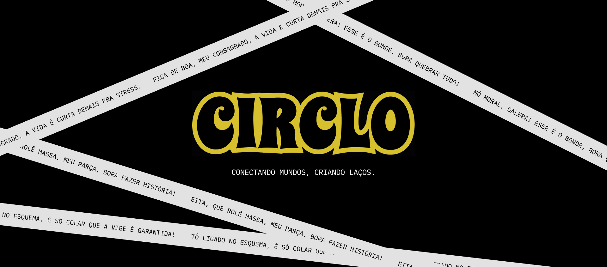
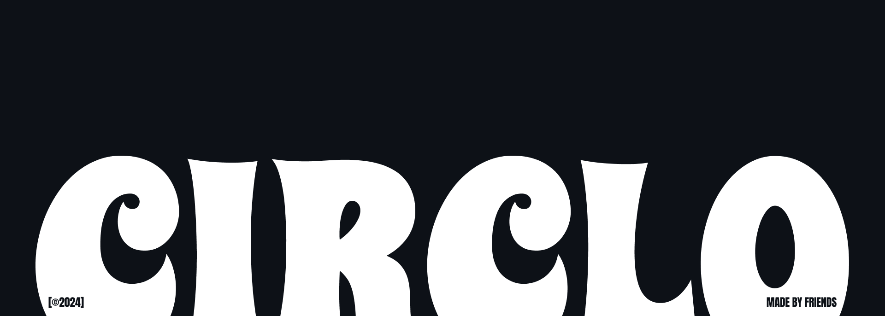

<p align="center">
  
</p>

</br>

### Bem-vindo ao Circlo! 🔆💛

Circlo não é apenas mais um site; é um espaço online vibrante projetado especificamente para os jovens e os aventureiros. Aqui, acreditamos no poder das ideias e na beleza da autoexpressão. Com um design elegante e moderno, o Circlo oferece uma plataforma onde os usuários podem livremente compartilhar seus pensamentos, mostrar sua criatividade e interagir com pessoas de mentalidade semelhante. Seja para navegar, compartilhar ou competir, o Circlo tem algo para todos.

</br>

# Recursos

## Mensagens Temporárias ⏳💬

> Já teve um pensamento que queria compartilhar, mas não queria que ele permanecesse para sempre? O recurso de mensagens temporárias do Circlo é perfeito para você. Expresse-se livremente com mensagens que desaparecem após 24 horas, localizadas bem na página inicial para todos os visitantes verem. É um espaço dinâmico onde as ideias fluem e as conversas evoluem em tempo real.

## Galeria de Fotos Enviadas por Usuários 📸✨

> Faça upload de fotos engraçadas da sua galeria e deixe a comunidade votar quem será a estrela da semana. Seja uma careta hilária, uma cena inusitada ou uma montagem divertida, compartilhe suas imagens e entre na competição pela diversão mais contagiosa. Deixe sua criatividade brilhar na galeria de fotos do Circlo e participe dessa jornada cheia de risadas e diversão! Sua foto chegará ao topo?

## Perfis Personalizados 🖌️🎨

> Seu perfil é sua tela no Circlo. Com um design minimalista e moderno, você tem a liberdade de se expressar. Personalize seu perfil com suas cores, temas e widgets favoritos de fontes de terceiros. É o seu espaço para mostrar quem você é e o que é importante para você.

</br>

## Comece Agora!

Começar com o Circlo é fácil:

1. **Cadastre-se**: Junte-se à nossa comunidade vibrante criando sua conta.
2. **Explore**: Explore o mundo do Circlo. Navegue em mensagens temporárias, descubra fotos cativantes e conecte-se com outros usuários.
3. **Compartilhe**: Compartilhe seus pensamentos, faça upload de suas fotos e interaja com a comunidade.
4. **Vote**: Participe de nossa competição semanal de fotos votando em suas fotos favoritas.

</br>

## Ferramentas Recomendadas

Para aproveitar ao máximo sua experiência no Circlo, recomendamos o seguinte:

- **VSCode com Volar**: Para uma experiência de desenvolvimento perfeita se desejar contribuir para a plataforma.
- **Referência de Configuração Vite**: Explore as opções de configuração Vite se quiser se aprofundar nos aspectos técnicos.

</br>

## Configuração do Projeto

Para configurar o projeto Circlo localmente, siga estas etapas:

</br>

## Instalação

```sh
npm install

```

## Modo de Desenvolvimento

```sh
npm run dev

```

## Compilação de Produção

```sh
npm run build

````

## Linting

```sh
npm run lint

````

</br>

## Junte-se à Comunidade 🤝🌟

Conecte-se conosco e com outros entusiastas do Circlo nas redes sociais. Siga-nos para atualizações, anúncios e um vislumbre da vibrante comunidade Circlo.

Pronto para embarcar em sua jornada Circlo? Cadastre-se agora e deixe suas ideias decolarem! 🚀⭐️

</br>

<p align="center"><a href="https://github.com/rxyhn/bspdots/blob/main/LICENSE"></a></p>

</br>

<p align="center">
  
</p>
